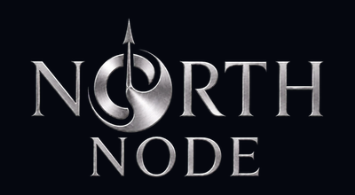

  

  
  
  

<h3 align="center">Connect with me</h3>

  
  &nbsp;
  
  &nbsp;
  
  &nbsp;
  
  &nbsp;
  
  &nbsp;
  
  &nbsp;
  
  &nbsp;
  

  

  
  
  
  

  

  

I am **Eswar N**, Founder &amp; CEO of [**NorthNode**](https://northnode.live) — a technology company incubated at **Garden City University**, Bengaluru. I lead product architecture and development across EdTech, SaaS, healthcare, and AI-powered platforms.

**System design is my core strength** — I plan and architect the system design for every app we build at NorthNode, from EduTrack to GamiBar and every client platform we deliver. Architecture, data flow, scalability, and how systems actually run in production — that's what I own before code ships.

NorthNode exists to build intelligent systems that institutions can actually run: examinations, learning, classroom engagement, physiotherapy care, and custom digital products for partners.

<table>
  <tr>
    <td>
      <blockquote>
        
🏢 <strong>Founder &amp; CEO</strong> @ NorthNode Technologies

        
🧩 <strong>System design architect</strong> — I plan the architecture for every NorthNode product and client delivery

        
🧠 I lead architecture, product, and engineering across our full product lineup

        
🎓 B.Tech CSE — Robotics @ Garden City University (2024–2028)

        
📍 Garden City University, Battarahalli, Bengaluru

        
📧 <a href="mailto:nalamalaeswar@gmail.com">nalamalaeswar@gmail.com</a> · <a href="mailto:support@northnode.live">support@northnode.live</a> · +91 63033 92391

        
🌐 <a href="https://northnode.live">northnode.live</a> · <a href="https://www.linkedin.com/in/eswar-n/">LinkedIn</a> · <a href="https://www.instagram.com/eswar_sonu">Instagram</a>

      </blockquote>
    </td>
  </tr>
</table>

**What I care about:** system design, scalable backends, AI-assisted workflows, and UI that feels production-ready — not prototype-ready.

  

  

Before founding NorthNode, I already had a strong track record shipping for clients outside India and building in emerging tech stacks.

<table>
  <tr>
    <td>
      <blockquote>
        
🌍 <strong>Foreign client projects</strong> — delivered multiple projects for international clients before NorthNode, across web products, custom builds, and production-grade software

        
🧭 <strong>AR internship</strong> — worked on <strong>indoor navigation with AR</strong> using <strong>Mattercraft</strong> (Zap Works), building spatial experiences and navigation flows in augmented reality

        
⚙️ That foundation — client delivery, AR, and system thinking — is what I brought into every NorthNode product today

      </blockquote>
    </td>
  </tr>
</table>

  

  

  

  <strong>NorthNode — Beyond Intelligence</strong> 
  EdTech · SaaS · AI-powered solutions 
  <a href="https://northnode.live">northnode.live</a>
  ·
  <a href="https://www.linkedin.com/company/north-node-0/">LinkedIn</a>
  ·
  <a href="https://github.com/NorthNodeTech">GitHub Org</a>
  ·
  <a href="https://www.instagram.com/northnode.live/">Instagram</a>

NorthNode is a technology-driven company building intelligent digital products across education, healthcare, and enterprise workflows. I founded the company, lead it as CEO, and personally architect the system design and development of our products and client platforms.

We are proudly incubated at **Garden City University Incubation Foundation**.

  
  &nbsp;&nbsp;
  

  

  

The path started with **EduTrack** for students around me. It grew into NorthNode — and into a lineup of platforms I still architect and lead end-to-end. **I plan the system design for every one of these.**

<table>
  <tr>
    <td width="50%" valign="top" align="center">
      
        
      <strong>EduTrack</strong> 
      
      
        
      Student-first academic workspace — coursework, exam practice, SGPA tracking, learning resources, and campus tools. Where the NorthNode journey began.
        
      <em>EduPPT · EduWord · EduChat · EduCalculator · EduContribute · practice exams</em>
        
      
      
    </td>
    <td width="50%" valign="top" align="center">
      
        
      <strong>EduXam</strong> 
      
      
        
      AI-assisted examination and academic analytics for schools, universities, and organizations — create, conduct, evaluate, and analyze exams in one system.
        
      <em>AI proctoring · automated evaluation · coding assessments · recruiter portal · analytics</em>
        
      
      
    </td>
  </tr>
  <tr>
    <td width="50%" valign="top" align="center">
      
        
      <strong>Abhyas</strong> 
      
      
        
      Competitive exam preparation focused on <strong>JEE &amp; NEET</strong> — mock tests, performance analytics, personalized practice, and student-first learning systems.
        
      <em>Mock tests · practice systems · performance analytics</em>
        
      
    </td>
    <td width="50%" valign="top" align="center">
      
        
      <strong>GamiBar</strong> 
      
      
        
      Live classroom games, quizzes, and activities. Teachers create a room in minutes, share a 6-digit code or QR, and run synchronized rounds with live results.
        
      <em>Quiz · Jigsaw · Connect Dots · live leaderboard · unlimited join-by-code</em>
        
      
      
    </td>
  </tr>
</table>

  

  

I architect and lead development for NorthNode client platforms — system design, engineering, and delivery. These are live partnerships, not side experiments.

<table>
  <tr>
    <td width="25%" align="center" valign="top">
      
       
      <strong>PhysioFlex Studio</strong> 
      Healthcare · MOTUS AI 
      <a href="https://physioflexstudio-website.onrender.com/">Visit →</a>
    </td>
    <td width="25%" align="center" valign="top">
      
       
      <strong>CorpErgo</strong> 
      Technical partner · 5 clinics 
      <a href="https://corpergo.in/">corpergo.in →</a>
    </td>
    <td width="25%" align="center" valign="top">
      
       
      <strong>Singularis Wealth</strong> 
      Wealth · digital experience 
      <a href="https://singularisfamilyoffice.com/">Visit →</a>
    </td>
    <td width="25%" align="center" valign="top">
      
       
      <strong>Apitherapy (AAI)</strong> 
      Official technology partner 
      <a href="https://apitherapyindia.org/">apitherapyindia.org →</a>
    </td>
  </tr>
  <tr>
    <td width="25%" align="center" valign="top">
      
       
      <strong>Swarn Madhu</strong> 
      Wellness · digital commerce 
      <a href="https://swarnmadhuhoney.com/">swarnmadhuhoney.com →</a>
    </td>
    <td width="25%" align="center" valign="top">
      
       
      <strong>Sri Vani Academy</strong> 
      Education partner
    </td>
    <td width="25%" align="center" valign="top">
      
       
      <strong>The Retirement Project</strong> 
      Wellness partner 
      <a href="https://www.theretirementproject.com/">Visit →</a>
    </td>
    <td width="25%" align="center" valign="top">
      
       
      <strong>Garden City University</strong> 
      Incubation partner 
      <a href="https://www.gardencity.university/">Visit →</a>
    </td>
  </tr>
</table>

  
<strong>Selected delivery notes</strong>

   
  <ul>
    <li><strong>PhysioFlex Studio</strong> — physiotherapy platform with patient engagement, mobility assessment, rehab planning, and <strong>MOTUS</strong> (Movement-Oriented Therapy Unified System), an AI companion for personalized exercise flows.</li>
    <li><strong>CorpErgo</strong> — NorthNode is the technical partner, leading software for all <strong>five CorpErgo physiotherapy clinics</strong> across Bengaluru.</li>
    <li><strong>Singularis Wealth</strong> — premium digital experience for a modern wealth organization, built around trust and clarity.</li>
    <li><strong>AAI + Swarn Madhu + Sri Vani Academy</strong> — official technology partner for three organizations led with Dr. Bhargava H R.</li>
  </ul>

  

  

  

  
  
  
  
  
  
  

  
  
  
  

  

  

  <picture>
    <source media="(prefers-color-scheme: dark)" srcset="https://github-readme-stats.vercel.app/api?username=eswar007206&show_icons=true&include_all_commits=true&count_private=true&hide_border=true&bg_color=0B1220&title_color=60A5FA&icon_color=3B82F6&text_color=E5E7EB&ring_color=3B82F6&rank_icon=github&border_radius=16"/>
    <source media="(prefers-color-scheme: light)" srcset="https://github-readme-stats.vercel.app/api?username=eswar007206&show_icons=true&include_all_commits=true&count_private=true&hide_border=true&bg_color=F8FAFC&title_color=1D4ED8&icon_color=2563EB&text_color=0F172A&ring_color=2563EB&rank_icon=github&border_radius=16"/>
    
  </picture>
  <picture>
    <source media="(prefers-color-scheme: dark)" srcset="https://github-readme-stats.vercel.app/api/top-langs/?username=eswar007206&layout=compact&langs_count=8&hide_border=true&exclude_repo=eswar007206&bg_color=0B1220&title_color=60A5FA&text_color=E5E7EB&border_radius=16"/>
    <source media="(prefers-color-scheme: light)" srcset="https://github-readme-stats.vercel.app/api/top-langs/?username=eswar007206&layout=compact&langs_count=8&hide_border=true&exclude_repo=eswar007206&bg_color=F8FAFC&title_color=1D4ED8&text_color=0F172A&border_radius=16"/>
    
  </picture>

  <picture>
    <source media="(prefers-color-scheme: dark)" srcset="https://streak-stats.demolab.com?user=eswar007206&theme=dark&hide_border=true&background=0B1220&ring=3B82F6&fire=F59E0B&currStreakNum=E5E7EB&sideNums=60A5FA&currStreakLabel=60A5FA&sideLabels=94A3B8&dates=64748B&border_radius=16"/>
    <source media="(prefers-color-scheme: light)" srcset="https://streak-stats.demolab.com?user=eswar007206&theme=default&hide_border=true&background=F8FAFC&ring=2563EB&fire=F59E0B&currStreakNum=0F172A&sideNums=1D4ED8&currStreakLabel=1D4ED8&sideLabels=475569&dates=64748B&border_radius=16"/>
    
  </picture>

  

  <picture>
    <source media="(prefers-color-scheme: dark)" srcset="https://github-readme-activity-graph.vercel.app/graph?username=eswar007206&bg_color=0b1220&color=e5e7eb&line=3b82f6&point=60a5fa&area=true&hide_border=true&custom_title=Contribution%20graph&radius=16"/>
    <source media="(prefers-color-scheme: light)" srcset="https://github-readme-activity-graph.vercel.app/graph?username=eswar007206&bg_color=f8fafc&color=0f172a&line=2563eb&point=3b82f6&area=true&hide_border=true&custom_title=Contribution%20graph&radius=16"/>
    
  </picture>

  

  

If you are an institution, founder, or operator who needs software that actually ships — [NorthNode](https://northnode.live) is open for products, partnerships, and custom builds.

  
  &nbsp;
  
  &nbsp;
  
  &nbsp;
  
  &nbsp;
  
  &nbsp;
  
  &nbsp;
  

  <em>NorthNode — Beyond Intelligence.</em> 
  Building products that make technology more useful, accessible, and impactful.

  

