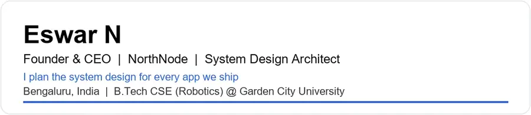
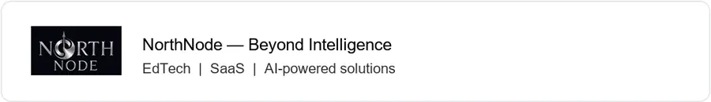
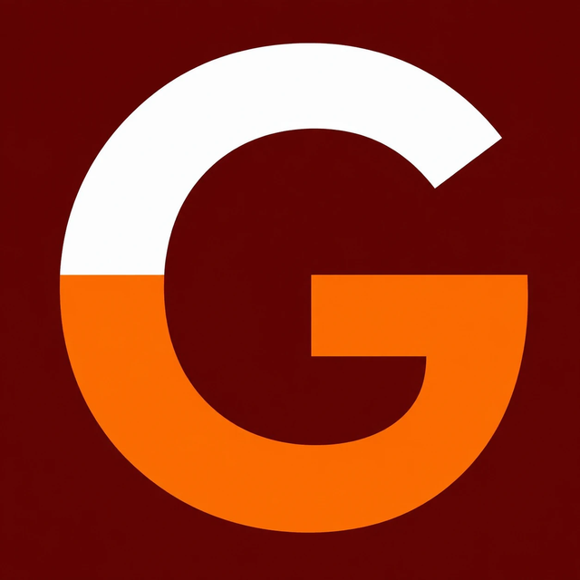
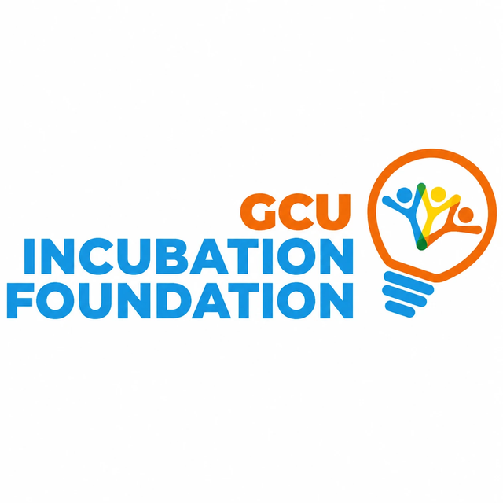
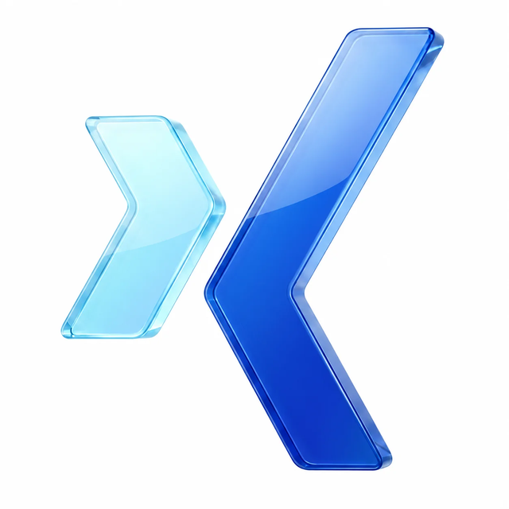
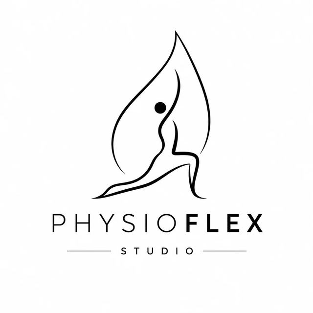
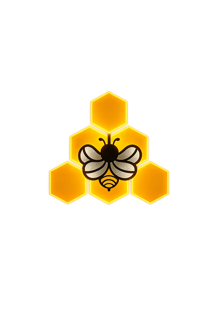
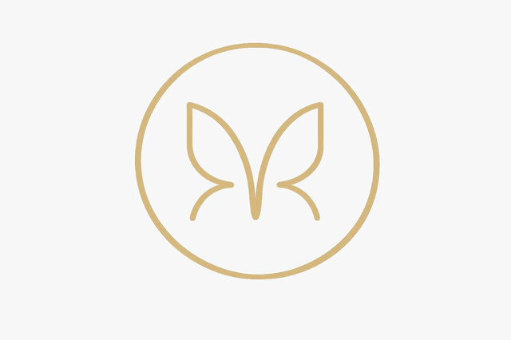

<p align="left">
  
</p>

```text
🧩  System design architect — I plan architecture for every NorthNode product
🏢  Founder & CEO @ NorthNode Technologies
🌍  Foreign client projects before NorthNode
🧭  AR internship — indoor navigation with Mattercraft (Zap Works)
```

### Connect with me

<p align="left">
  <a href="https://northnode.live" target="_blank" title="Website">
    
  </a>
  &nbsp;
  <a href="https://github.com/eswar007206" target="_blank" title="GitHub">
    
  </a>
  &nbsp;
  <a href="https://github.com/NorthNodeTech" target="_blank" title="NorthNode GitHub">
    
  </a>
  &nbsp;
  <a href="https://www.linkedin.com/in/eswar-n/" target="_blank" title="LinkedIn">
    
  </a>
  &nbsp;
  <a href="https://www.instagram.com/eswar_sonu" target="_blank" title="Instagram Personal">
    
  </a>
  &nbsp;
  <a href="https://www.instagram.com/northnode.live/" target="_blank" title="Instagram NorthNode">
    
  </a>
  &nbsp;
  <a href="mailto:nalamalaeswar@gmail.com" title="Personal Email">
    
  </a>
  &nbsp;
  <a href="mailto:support@northnode.live" title="NorthNode Email">
    
  </a>
</p>

**Contact**

- Personal → [nalamalaeswar@gmail.com](mailto:nalamalaeswar@gmail.com)
- NorthNode → [support@northnode.live](mailto:support@northnode.live)
- Website → [northnode.live](https://northnode.live)
- Phone → +91 63033 92391

---

## About

I'm **Eswar N**, Founder & CEO of [**NorthNode**](https://northnode.live) — incubated at **Garden City University**, Bengaluru.

**System design is what I do best.** I architect every platform we build: data flow, scalability, services, and how systems run in production — before the team writes code.

Before NorthNode, I shipped for **international clients** and interned on **indoor AR navigation** with **Mattercraft** (Zap Works).

---

## NorthNode

<p align="left">
  
</p>

Incubated at Garden City University Incubation Foundation.

<p align="left">
  <a href="https://www.gardencity.university/"></a>
  &nbsp;
  <a href="https://www.linkedin.com/showcase/gcuifdn/"></a>
</p>

---

## Products I built & lead

I plan the system design for every product below.

| | | |
|:---:|:---:|:---:|
| <a href="https://edutrackonline.online"></a> | <a href="https://eduxam.in"></a> | <a href="https://abhyasexams.in"></a> |
| [**EduTrack**](https://edutrackonline.online) · Live | [**EduXam**](https://eduxam.in) · Building | [**Abhyas**](https://abhyasexams.in) · Building |
| Student academic workspace | AI examination platform | JEE & NEET prep |
| <a href="https://gamibar.com"></a> | | |
| [**GamiBar**](https://gamibar.com) · Building | | |
| Live classroom games & quizzes | | |

---

## Client products I lead

| | | | |
|:---:|:---:|:---:|:---:|
| <a href="https://physioflexstudio-website.onrender.com/"></a> | <a href="https://corpergo.in/"></a> | <a href="https://singularisfamilyoffice.com/"></a> | <a href="https://apitherapyindia.org/"></a> |
| [PhysioFlex](https://physioflexstudio-website.onrender.com/) | [CorpErgo](https://corpergo.in/) | [Singularis](https://singularisfamilyoffice.com/) | [AAI](https://apitherapyindia.org/) |
| <a href="https://swarnmadhuhoney.com/"></a> |  | <a href="https://www.theretirementproject.com/"></a> | <a href="https://www.gardencity.university/"></a> |
| [Swarn Madhu](https://swarnmadhuhoney.com/) | Sri Vani Academy | [Retirement Project](https://www.theretirementproject.com/) | [GCU](https://www.gardencity.university/) |

---

## Tech stack

<p align="left">
  
</p>

React Native · Zustand · GSAP · Framer Motion · BullMQ · Judge0 · OpenRouter · Mattercraft · System Design

---

## GitHub stats

<p align="left">
  <picture>
    <source media="(prefers-color-scheme: dark)" srcset="https://github-readme-stats.vercel.app/api?username=eswar007206&show_icons=true&include_all_commits=true&count_private=true&hide_border=true&bg_color=0D1117&title_color=58A6FF&text_color=E6EDF3&icon_color=58A6FF&ring_color=58A6FF&border_radius=8"/>
    
  </picture>
  <picture>
    <source media="(prefers-color-scheme: dark)" srcset="https://github-readme-stats.vercel.app/api/top-langs/?username=eswar007206&layout=compact&langs_count=6&hide_border=true&bg_color=0D1117&title_color=58A6FF&text_color=E6EDF3&border_radius=8"/>
    
  </picture>
</p>

<p align="left">
  <picture>
    <source media="(prefers-color-scheme: dark)" srcset="https://streak-stats.demolab.com?user=eswar007206&hide_border=true&background=0D1117&ring=58A6FF&fire=58A6FF&currStreakLabel=58A6FF&sideLabels=8B949E&currStreakNum=E6EDF3&dates=8B949E&border_radius=8"/>
    
  </picture>
</p>

---

## Let's build

Open for products, partnerships, and custom builds at [NorthNode](https://northnode.live).

<p align="left">
  <a href="https://northnode.live" target="_blank"></a>
  &nbsp;
  <a href="https://github.com/eswar007206" target="_blank"></a>
  &nbsp;
  <a href="https://www.linkedin.com/in/eswar-n/" target="_blank"></a>
  &nbsp;
  <a href="https://www.instagram.com/eswar_sonu" target="_blank"></a>
  &nbsp;
  <a href="mailto:nalamalaeswar@gmail.com"></a>
</p>

*NorthNode — Beyond Intelligence.*
