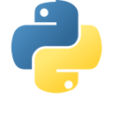
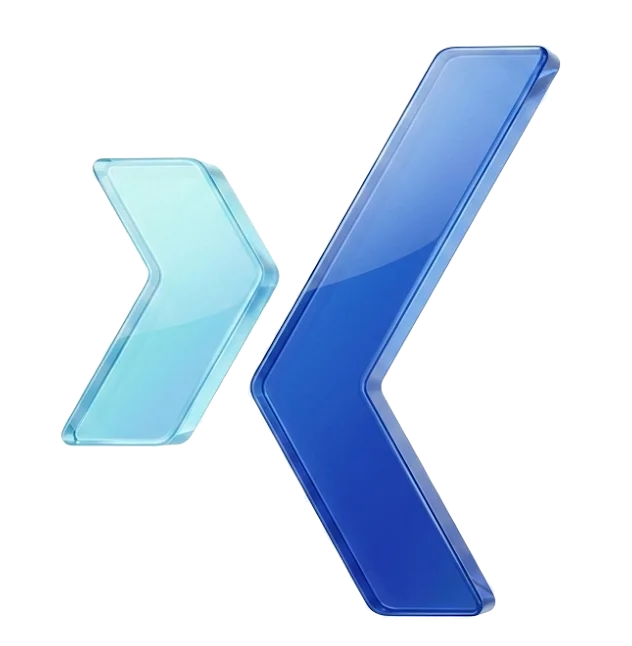
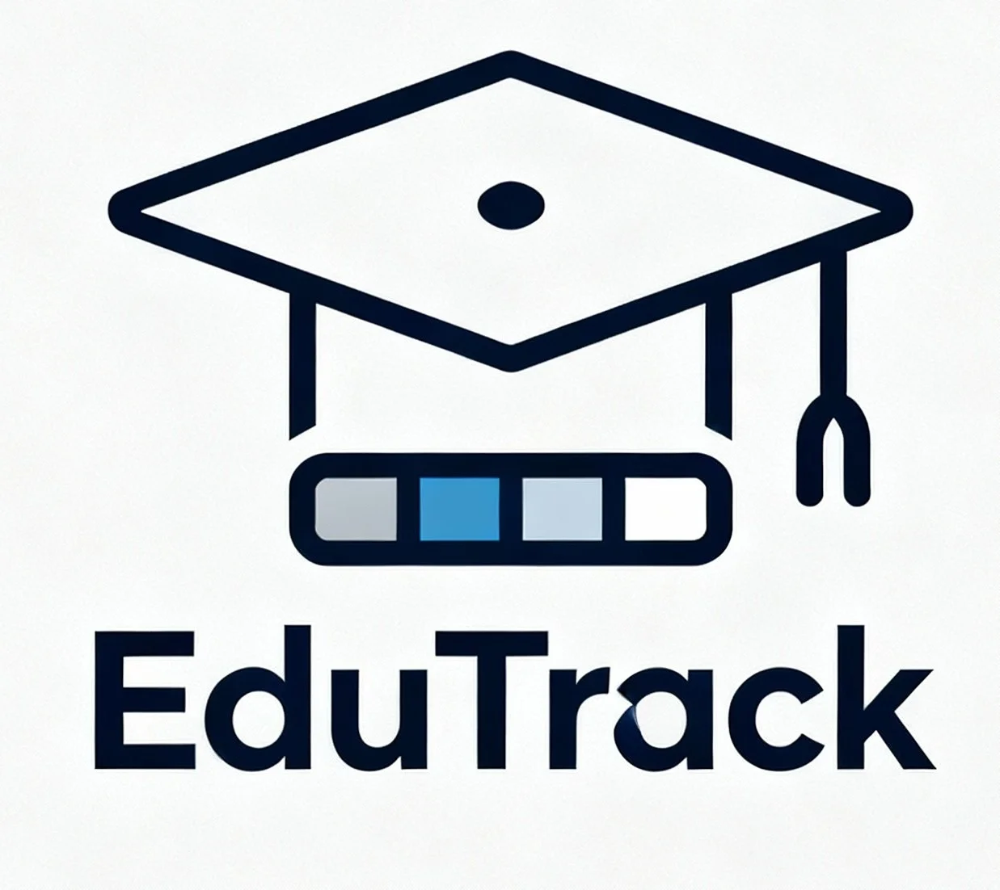
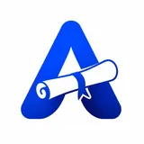
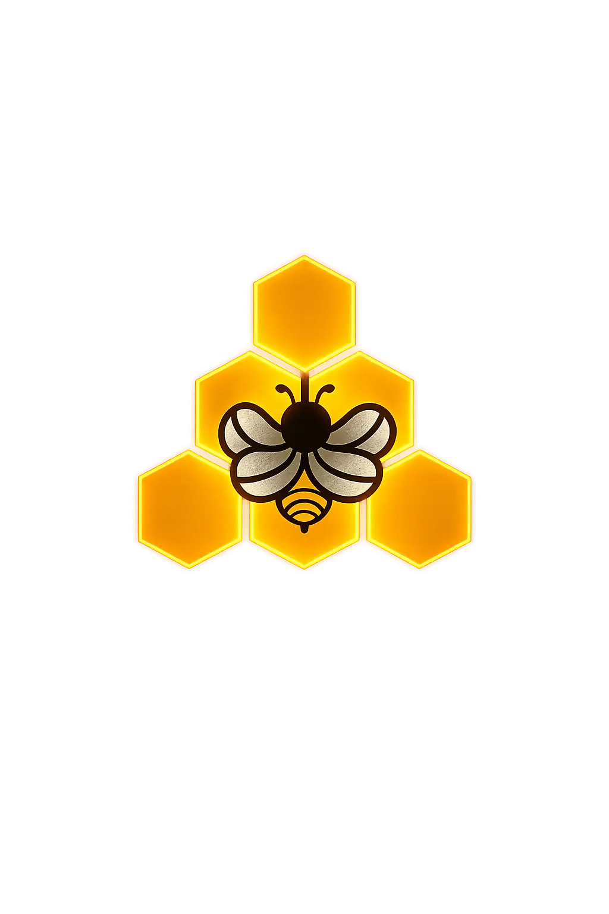

<table>
<tr>
<td width="38%" valign="top">
  
    
  
  &nbsp;
  
  &nbsp;
  
  &nbsp;
  
    
  <blockquote>
    
<strong>INTERESTING FACT</strong>

    
<em>“Founded NorthNode Technologies as Founder &amp; CEO. At 19, I started freelancing and sent around 8,000–10,000 cold emails, messages, and calls before successfully delivering projects for international clients.”</em>

  </blockquote>
</td>
<td valign="top">

# Eswar N

**FOUNDER &amp; CEO · SYSTEM DESIGNER · BACKEND ARCHITECT**

> “Pressure is a privilege.”

## About

Software engineer specializing in **system design** and **backend architecture building**, with strong full-stack and AI product experience. Founder &amp; CEO of [NorthNode](https://northnode.live), working across products like EduXam, GamifyTL, ABHYAS, and other technology initiatives. Experienced in designing scalable systems and delivering production-ready solutions for international clients across EdTech, SaaS, and other domains.

I love doing system design — architecture, data flow, APIs, databases, and backends that hold up in production.

## Areas of Expertise

`System Design` `Scalable Backend Architecture` `Backend Architecture Building` `API Architecture` `Database Architecture` `Full-Stack Engineering` `AI-powered Applications` `EdTech Platforms` `SaaS Products` `Product Engineering` `Technical Problem Solving`

</td>
</tr>
</table>

---

## Tech Stack

### Languages

<table>
  <tr>
    <td align="center" width="20%"> Python</td>
    <td align="center" width="20%"> JavaScript</td>
    <td align="center" width="20%"> TypeScript</td>
    <td align="center" width="20%"> C</td>
    <td align="center" width="20%"> C++</td>
  </tr>
</table>

### Frontend

<table>
  <tr>
    <td align="center" width="16%"> React</td>
    <td align="center" width="16%"> Next.js</td>
    <td align="center" width="16%"> React Native</td>
    <td align="center" width="16%"> Expo</td>
    <td align="center" width="16%"> HTML</td>
    <td align="center" width="16%"> CSS</td>
  </tr>
</table>

### Backend

<table>
  <tr>
    <td align="center" width="20%"> FastAPI</td>
    <td align="center" width="20%"> Node.js</td>
    <td align="center" width="20%"> Express</td>
    <td align="center" width="20%"> REST APIs</td>
    <td align="center" width="20%"> JWT</td>
  </tr>
</table>

### Database &amp; Infra

<table>
  <tr>
    <td align="center" width="33%"> PostgreSQL</td>
    <td align="center" width="33%"> Supabase</td>
    <td align="center" width="33%"> Redis</td>
  </tr>
</table>

### AI / ML

<table>
  <tr>
    <td align="center" width="16%"> Gemini</td>
    <td align="center" width="16%"> OpenAI</td>
    <td align="center" width="16%"> Mistral</td>
    <td align="center" width="16%"> Rasa</td>
    <td align="center" width="16%"> LLMs</td>
    <td align="center" width="16%"> ML</td>
  </tr>
</table>

### Other

<table>
  <tr>
    <td align="center" width="14%"> Git</td>
    <td align="center" width="14%"> GitHub</td>
    <td align="center" width="14%"> Razorpay</td>
    <td align="center" width="14%"> YouTube API</td>
    <td align="center" width="14%"> yt-dlp</td>
    <td align="center" width="14%"> Render</td>
    <td align="center" width="14%"> HLS</td>
  </tr>
</table>

---

## Professional Experience

### Founder &amp; CEO · [NorthNode Technologies](https://northnode.live)
**2026 – Present**

Founded and led NorthNode while building multiple products across EdTech, AI, and SaaS. Combined product strategy, system design, and hands-on engineering to turn ideas into working technology products. Led technical/product direction for EduXam, GamifyTL, ABHYAS, and PhysioFlex Studio.

### Full Stack Engineer · Nerds &amp; Geeks Pvt Ltd
**Sep 2025 – Jun 2026** · Bengaluru, Karnataka, India

Worked as a Full Stack Developer on an AR-based indoor navigation project, contributing to the development and implementation of the application.

### Freelance Full-Stack Developer · International Clients
**2023 – Present**

Started freelancing at 19 and delivered four production-ready projects for international clients, including clients from Japan. Worked across websites, real-estate platforms, data-scraping systems, and PWAs, handling client requirements, development, integrations, and delivery.

---

## Featured Projects

<table>
<tr>
<td width="50%" valign="top">
   
  <strong><a href="https://eduxam.in">EduXam</a></strong> · NorthNode Product 
  AI-powered Examination &amp; Academic Intelligence Platform 
  <em>Founder &amp; CEO / Product Lead</em>
  <ul>
    <li>Designed the overall product architecture and built full-stack functionality.</li>
    <li>Designed online examination workflows and integrated AI-powered evaluation.</li>
    <li>Worked on career guidance, verified student skill profiles, and recruiter workflows.</li>
    <li>Designed backend and infrastructure architecture.</li>
  </ul>
  React · Next.js · Python · FastAPI · Supabase · PostgreSQL · Redis · AI / LLM APIs
</td>
<td width="50%" valign="top">
   
  <strong><a href="https://gamibar.com">GamifyTL</a></strong> · NorthNode Product 
  Gamified Classroom &amp; Live Session Platform 
  <em>Founder &amp; CEO / Product &amp; Technical Lead</em>
  <ul>
    <li>Designed the product concept and interactive classroom experiences.</li>
    <li>Built gamified games and session tools for teachers, speakers, and learners.</li>
    <li>Worked on UI/UX, designed application architecture, and developed the platform.</li>
  </ul>
  React · JavaScript · Supabase
</td>
</tr>
<tr>
<td width="50%" valign="top">
   
  <strong><a href="https://edutrackonline.online">EduTrack</a></strong> · NorthNode Product 
  University Productivity Platform 
  <em>Founder / System Architect</em>
  <ul>
    <li>Architected student workspace, campus tools, and academic tracking engines.</li>
    <li>Designed schedule management and student productivity workflows.</li>
  </ul>
  React · Next.js · FastAPI · Supabase · PostgreSQL
</td>
<td width="50%" valign="top">
   
  <strong><a href="https://abhyasexams.in">Abhyas</a></strong> · NorthNode Product 
  Flagship Education Platform &amp; Learning System 
  <em>Founder &amp; CEO / System Designer</em>
  <ul>
    <li>Worked on overall platform strategy, backend design, and user experience.</li>
    <li>Supported technical architecture for examination engines and practice modules.</li>
  </ul>
  React · Python · FastAPI · Supabase · PostgreSQL
</td>
</tr>
<tr>
<td width="50%" valign="top">
   
  <strong>PhysioFlex Studio</strong> · NorthNode Product 
  Healthcare &amp; Physiotherapy Technology Platform 
  <em>Founder &amp; CEO / Technical Lead</em>
  <ul>
    <li>Architected patient care workflows, therapist portals, and mobility tracking tools.</li>
    <li>Designed backend services and application integrations.</li>
  </ul>
  React · FastAPI · Supabase · PostgreSQL
</td>
<td width="50%" valign="top">
   
  <strong>Singularis Wealth</strong> · NorthNode Product 
  Wealth &amp; Financial Services Digital Platform 
  <em>Founder &amp; CEO / System Architect</em>
  <ul>
    <li>Built a high-performance, secure digital experience for wealth management services.</li>
    <li>Designed architecture and user experience for modern family office presentation.</li>
  </ul>
  Next.js · React · TypeScript · Tailwind CSS
</td>
</tr>
<tr>
<td width="50%" valign="top">
   
  <strong>GCU Physiocare</strong> · NorthNode Product 
  University Physiotherapy &amp; Wellness Platform 
  <em>Founder &amp; CEO / System Architect</em>
  <ul>
    <li>Supported clinic management architecture, patient records, and consultation workflows.</li>
  </ul>
  React · Supabase · PostgreSQL
</td>
<td width="50%" valign="top">
   
  <strong>Swarn Madhu</strong> · NorthNode Product 
  Health &amp; Wellness Digital Ecosystem 
  <em>Founder &amp; CEO / Architecture Support</em>
  <ul>
    <li>Provided technical guidance and infrastructure setup for digital commerce and brand experience.</li>
  </ul>
  React · Next.js
</td>
</tr>
<tr>
<td width="50%" valign="top">
   
  <strong>Corp Egro</strong> · NorthNode Product 
  Enterprise Workflow &amp; Business Modernization 
  <em>Founder &amp; CEO / Architecture Support</em>
  <ul>
    <li>Supported enterprise system design and workflow automation strategies.</li>
  </ul>
  React · Supabase · Node.js
</td>
<td width="50%" valign="top">
   
  <strong>Apitherapy</strong> · NorthNode Product 
  Healthcare &amp; Bee Therapy Wellness Partnership 
  <em>Founder &amp; CEO / Technical Advisory</em>
  <ul>
    <li>Supported digital platform setup and online healthcare portal development.</li>
  </ul>
  HTML · CSS · JavaScript
</td>
</tr>
<tr>
<td width="50%" valign="top">
   
  <strong>The Retirement Project</strong> · NorthNode Product 
  Purpose-Driven Wellness &amp; Life Planning Platform 
  <em>Founder &amp; CEO / System Architect</em>
  <ul>
    <li>Supported frontend implementation and digital platform architecture.</li>
  </ul>
  React · Next.js
</td>
<td width="50%" valign="top">
  <strong>PEAKAS</strong> · Freelance 
  Real Estate Bidding Platform (Japan) 
  <em>Full-Stack Developer</em>
  <ul>
    <li>Developed property listing system and bidding functionality.</li>
    <li>Developed admin dashboard and integrated traffic/click tracking.</li>
    <li>Integrated frontend and backend to translate client requirements to production.</li>
  </ul>
  React · Supabase
</td>
</tr>
<tr>
<td width="50%" valign="top">
  <strong>YouTube Data Scraping &amp; Analysis Tool</strong> · Freelance 
  Data Scraping &amp; Analytics Platform 
  <em>Full-Stack Developer</em>
  <ul>
    <li>Extracted video likes, comments, subscriber data, and captions (export to .md/.csv).</li>
    <li>Scraped all videos from a channel within a time range (up to 30 days).</li>
    <li>Generated top 10 most/least-viewed videos analytics.</li>
    <li>Implemented API-cost optimization using multiple user-provided API keys.</li>
  </ul>
  React · Python · yt-dlp · YouTube Data API
</td>
<td width="50%" valign="top">
  <strong>FeverEase</strong> · Hackathon 
  AI-powered Healthcare Prototype 
  <em>Selected All-India for the Microlabs Hackathon</em>
  <ul>
    <li>Built AI symptom assistant and conversational AI with multilingual voice interaction.</li>
    <li>Developed doctor discovery, appointment flow, and video consultation prototypes.</li>
    <li>Integrated medical report analysis.</li>
  </ul>
  React · Google Gemini API · Render
</td>
</tr>
</table>

---

## Awards &amp; Achievements

**Microlabs Hackathon** — Top 15 All-India  
Selected from approximately 200 competing teams across India.

**Microsoft Build with Copilot** — 2nd Place  
Secured 2nd place among 95 participants. Also received Most Liked LinkedIn Post recognition at the event.

---

## GitHub Stats

  <picture>
    <source media="(prefers-color-scheme: dark)" srcset="https://github-profile-summary-cards.vercel.app/api/cards/stats?username=eswar007206&theme=github_dark"/>
    <source media="(prefers-color-scheme: light)" srcset="https://github-profile-summary-cards.vercel.app/api/cards/stats?username=eswar007206&theme=default"/>
    
  </picture>
  <picture>
    <source media="(prefers-color-scheme: dark)" srcset="https://github-profile-summary-cards.vercel.app/api/cards/productive-time?username=eswar007206&theme=github_dark"/>
    <source media="(prefers-color-scheme: light)" srcset="https://github-profile-summary-cards.vercel.app/api/cards/productive-time?username=eswar007206&theme=default"/>
    
  </picture>

  

B.Tech CSE — Robotics @ Garden City University, Bengaluru.

[Portfolio](https://northnode.live/eswar-n) · [NorthNode](https://northnode.live) · [LinkedIn](https://www.linkedin.com/in/eswar-n-86b862311/) · [Email](mailto:nalamalaeswar@gmail.com)
